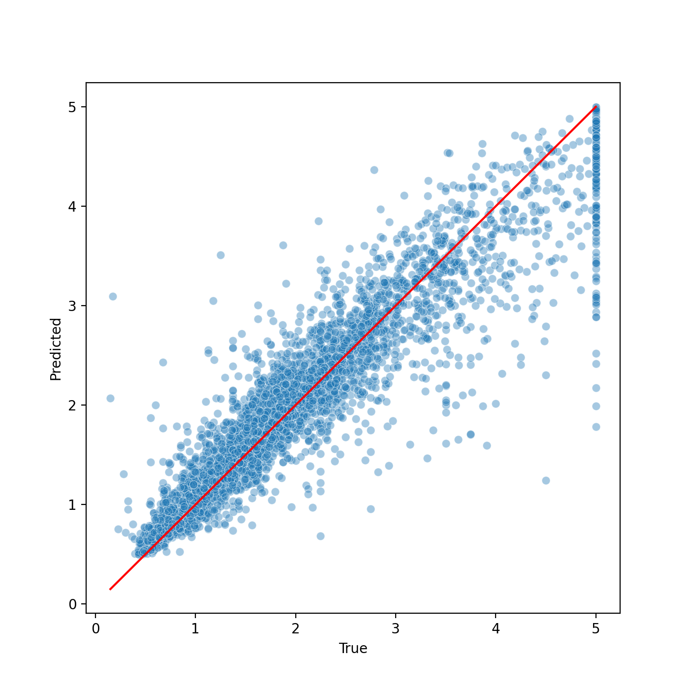
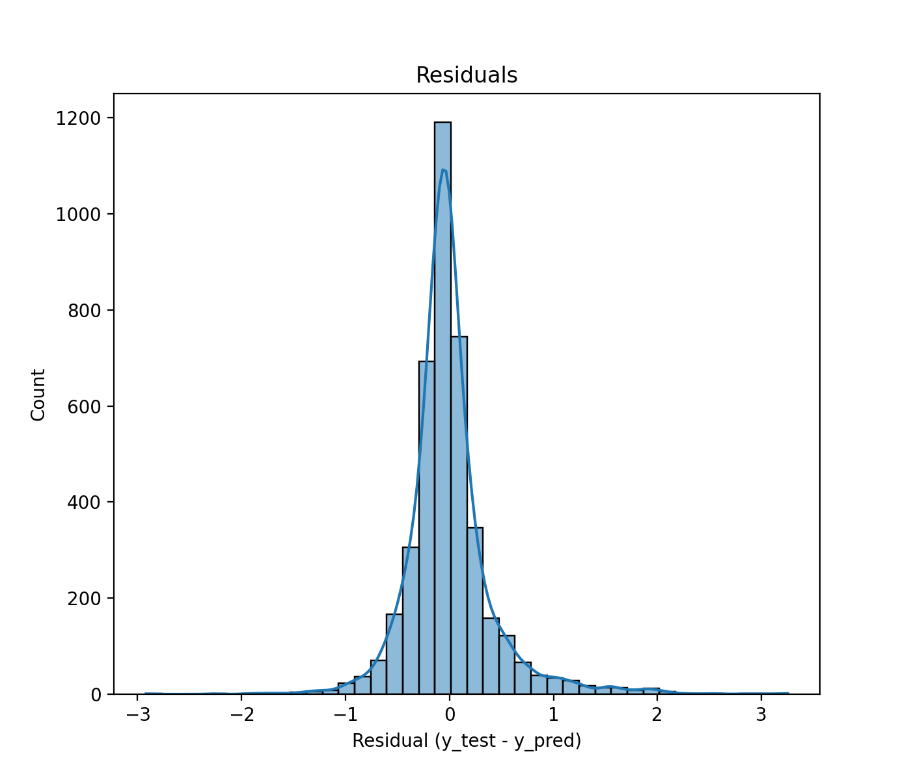

# California Housing Prices – Full End-to-End ML Pipeline  

[](https://www.python.org)
[](https://scikit-learn.org)
[](https://opensource.org/licenses/MIT)

A clean, reproducible, production-ready machine learning pipeline on the classic **California Housing** dataset (1990 census).  
Includes geographical feature engineering with **RBF cluster similarity**, full preprocessing, Random Forest training + hyperparameter tuning, detailed logging, model persistence, and rich reporting (plots + Excel).

Typical performance (after tuning):
- **R² ≈ 0.845 – 0.855**
- **MSE ≈ 0.23 – 0.25**

<div align="center">
  
  
</div>

## Features

- Automatic dataset download (`fetch_california_housing`) → saved locally as CSV  
- Geographical feature engineering using **RBF similarity to KMeans cluster centers** (10 clusters)  
- Leak-proof `ColumnTransformer` + `Pipeline` (imputation, scaling)  
- Base Random Forest + **RandomizedSearchCV** hyperparameter tuning  
- Professional rotating file logger  
- Model persistence (`joblib`) with preprocessor & custom transformer  
- Comprehensive reports:  
  - Scatter plot (true vs predicted)  
  - Residuals histogram  
  - Excel file with predictions, residuals and summary metrics  

## Quick Start

```bash
git clone https://github.com/tomrussobuilds/california-housing-pipeline.git
cd california-housing-pipeline
pip install -r requirements.txt
python main.py
```

All outputs are automatically generated in dedicated folders.

## Project Structure

```bash
.
├── main.py                     # Full pipeline execution
├── logger_module.py            # Rotating logger
├── cluster_similarity.py       # Custom RBF ClusterSimilarity transformer
├── requirements.txt
├── README.md
└── reports/                    # Generated on run (plots + Excel)
```

## Example Output

```bash
2025-11-27 14:10:13 - INFO - Dataset found at: /home/tommaso-russo/my_great_model/dataset/housing/housing.csv
2025-11-27 14:10:13 - INFO - CSV loaded successfully.
2025-11-27 14:10:13 - INFO - Dataset shape: (20640, 9), missing values: 0
2025-11-27 14:10:13 - INFO - Train/test split completed.
2025-11-27 14:10:13 - INFO - Starting feature engineering (cluster similarity)...
2025-11-27 14:10:14 - INFO - ClusterSimilarity fitted with 10 clusters, gamma=1.0
2025-11-27 14:10:14 - INFO - Added 10 cluster similarity features.
2025-11-27 14:10:14 - INFO - Processed shapes → X_train=(16512, 18), X_test=(4128, 18)
2025-11-27 14:10:14 - INFO - Training base Random Forest...
2025-11-27 14:10:15 - INFO - Base RF metrics → MSE: 0.18, R²: 0.8647
2025-11-27 14:10:15 - INFO - Sample predictions: [0.503 0.642 4.868 2.371 2.571]
2025-11-27 14:10:15 - INFO - True values: [0.477 0.458 5.    2.186 2.78 ]
2025-11-27 14:10:15 - INFO - Starting hyperparameter tuning...
```

## Reproducibility

- Fixed `random_state = 42` everywhere
- All artifacts saved with `joblib` (easy reload for inference)
- One-command full reproducibility

## Requirements

See `requirements.txt`

Install with:

```bash
pip install -r requirements.txt
```

## Future Ideas (feel free to contribute!)

- Add the original dataset with `ocean_proximity` categorical feature + `OneHotEncoder`
- Compare with Gradient Boosting (XGBoost/LightGBM/CatBoost)
- MLflow / Weights & Biases tracking
- Streamlit dashboard for interactive exploration

## License

MIT © 2025 Tommaso Russo – feel free to use, modify, and share!

